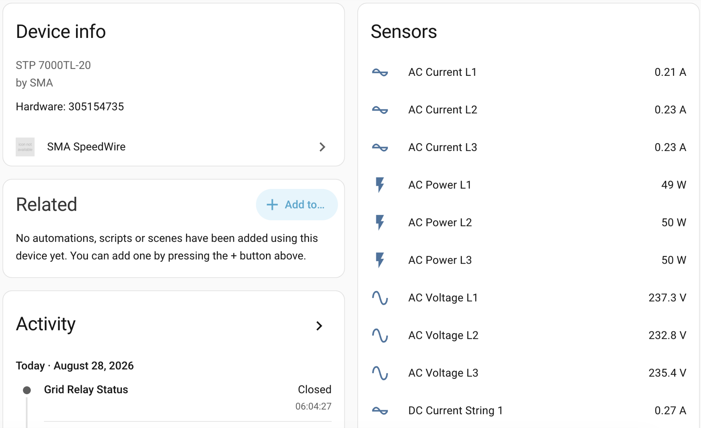
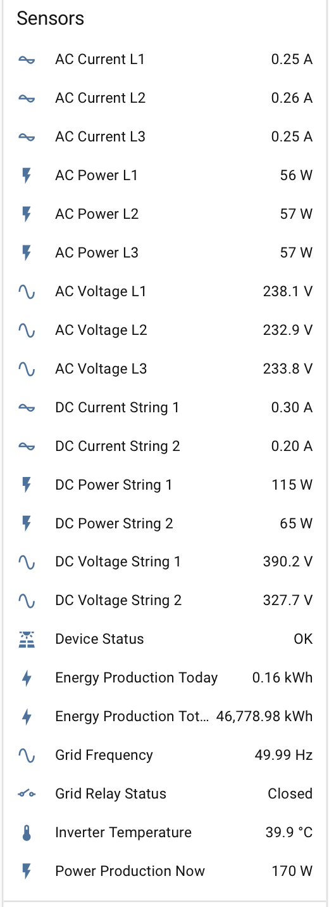

# SMA SpeedWire Integration for Home Assistant  

## About this fork

This fork adds configurable polling intervals and extended local diagnostics for SMA Speedwire inverters. All intervals can be changed from the Home Assistant integration options.

The three original entities remain unchanged for backward compatibility:
- Energy production total in kWh
- Energy production today in kWh
- Power production now in W

Starting with `0.2.0`, the integration can also expose:

- AC power, voltage and current for phases L1, L2 and L3
- DC power, voltage and current for strings 1 and 2
- Grid frequency
- Inverter temperature
- Device status and grid relay status

Extended entities are available only when the inverter model returns the corresponding Speedwire register. An unsupported optional register does not interrupt the three original production entities.

Diagnostic commands are staggered across normal production updates, so a refresh does not send the entire diagnostic query set at once. A repeatedly unsupported optional command is temporarily backed off and retried later; this avoids continuously delaying the established production sensors on inverter models that do not provide every register.

Version `0.2.0` includes the nighttime and sleep-state handling validated in `0.2.0-beta.2`. A supported register that contains SMA's no-value sentinel remains unavailable without being misclassified as an unsupported command, so it does not enter the 15-minute retry backoff. SMA status tag `16777213` is displayed as `Information not available`.

## Version history

### [v0.1.0 — Configurable polling interval](https://github.com/skurusa/ha_sma_speedwire/releases/tag/v0.1.0)

- Replaced the fixed 300-second refresh interval with a configurable 10–300 second interval.
- Added an integration options flow with automatic reload after saving.
- Set 30 seconds as the default and added English and Hungarian UI strings.
- Preserved the original integration domain, entity IDs and unique IDs.

### [v0.1.1 — Home Assistant 2026.12 compatibility](https://github.com/skurusa/ha_sma_speedwire/releases/tag/v0.1.1)

- Converted the inverter serial number to a string before assigning it to `DeviceInfo.hw_version`.
- Removed the related Home Assistant deprecation warning and prepared the integration for Home Assistant 2026.12.
- Kept the polling options and existing entity identities unchanged.

### [v0.1.2 — Missing-response reliability fix](https://github.com/skurusa/ha_sma_speedwire/releases/tag/v0.1.2)

- Added safe handling for empty or timed-out inverter responses.
- Preserved the last valid values when an update contains no usable response data.
- Corrected the manual installation path and refreshed the fork/HACS documentation and screenshots.
- Included the Home Assistant 2026.12 compatibility fix from `v0.1.1`.

### [v0.2.0-beta.1 — Extended diagnostics](https://github.com/skurusa/ha_sma_speedwire/releases/tag/v0.2.0-beta.1)

- Added optional per-phase AC and per-string DC power, voltage and current sensors.
- Added grid frequency, inverter temperature, device status and grid-relay status.
- Added separate configurable polling tiers for production, phase/DC and status diagnostics.
- Staggered diagnostic commands, added retry backoff for unsupported registers and isolated optional diagnostics from the three established production sensors.
- Kept existing production entity identities unchanged.

### [v0.2.0-beta.2 — Nighttime diagnostics fix](https://github.com/skurusa/ha_sma_speedwire/releases/tag/v0.2.0-beta.2)

- Recognizes SMA no-value sentinels as expected nighttime or sleep-state responses.
- Prevents sleeping diagnostic registers from being treated as unsupported or entering the 15-minute retry backoff.
- Maps SMA status tag `16777213` to `Information not available`.
- Automatically restores live diagnostic values when the inverter wakes, while preserving the production counters.

### [v0.2.0 — Stable extended diagnostics](https://github.com/skurusa/ha_sma_speedwire/releases/tag/v0.2.0)

- Promotes the validated `v0.2.0-beta.2` implementation to the stable release channel without functional changes.
- Includes extended AC, DC, grid, temperature and status diagnostics with configurable tiered polling.
- Includes missing-response protection, unsupported-register backoff and correct nighttime sleep-state handling.
- Keeps the three original production entities and their unique IDs unchanged.

## Validation: daytime and inverter sleep

During daytime operation, the extended AC, DC, grid, temperature and status entities are populated alongside the three established production sensors. The DC input power and the summed AC phase power can differ slightly because of inverter conversion losses and internal consumption.

The complete daytime entity list includes per-phase AC current, power and voltage; per-string DC current, power and voltage; device and grid-relay status; grid frequency; inverter temperature; and the established production sensors.

When the inverter enters its nighttime or sleep state, instantaneous AC/DC diagnostic entities may become `unavailable`. This is expected: the inverter is not publishing live conversion data. The daily and lifetime production counters are preserved. Since `0.2.0`, recognized registers containing SMA no-value sentinels are not treated as unsupported commands, do not enter the 15-minute retry backoff, and automatically populate again after the inverter wakes.
