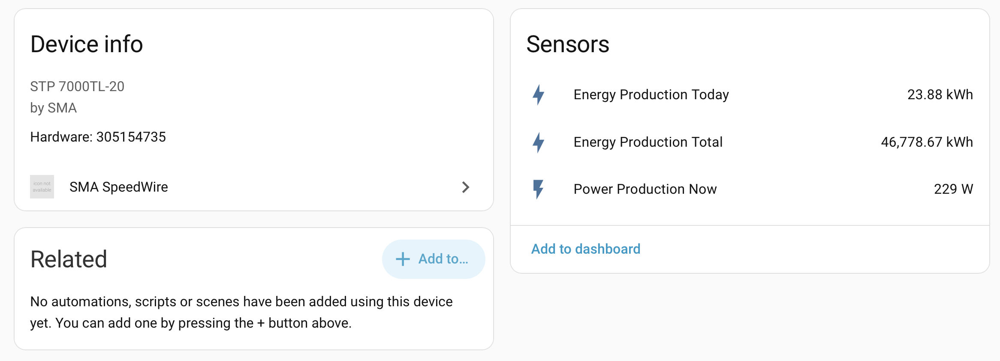
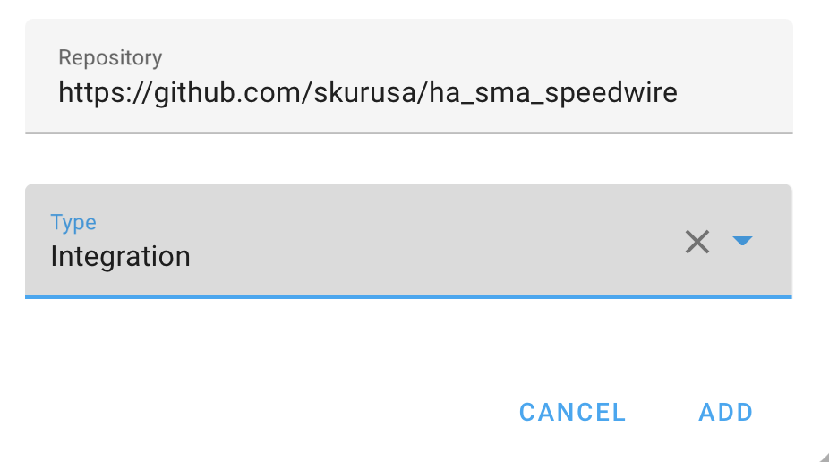

# SMA SpeedWire Integration for Home Assistant  

## About this fork

This fork adds configurable polling intervals and extended local diagnostics for SMA Speedwire inverters. All intervals can be changed from the Home Assistant integration options.

The three original entities remain unchanged for backward compatibility:
- Energy production total in kWh
- Energy production today in kWh
- Power production now in W

Starting with `0.2.0-beta.1`, the integration can also expose:

- AC power, voltage and current for phases L1, L2 and L3
- DC power, voltage and current for strings 1 and 2
- Grid frequency
- Inverter temperature
- Device status and grid relay status

Extended entities are available only when the inverter model returns the corresponding Speedwire register. An unsupported optional register does not interrupt the three original production entities.

Diagnostic commands are staggered across normal production updates, so a refresh does not send the entire diagnostic query set at once. A repeatedly unsupported optional command is temporarily backed off and retried later; this avoids continuously delaying the established production sensors on inverter models that do not provide every register.

`0.2.0-beta.2` fixes nighttime and sleep-state handling. A supported register that contains SMA's no-value sentinel remains unavailable without being misclassified as an unsupported command, so it does not enter the 15-minute retry backoff. SMA status tag `16777213` is displayed as `Information not available`.

`0.2.0-beta.2` remains a hardware-validation release. It is intended to verify the extended registers on real inverters before the stable `0.2.0` release.


The integration supports a range of SMA inverters. See the [supported inverter list](https://github.com/skurusa/ha_sma_speedwire/blob/main/custom_components/sma_speedwire/sma_speedwire.py#L27).

## Installation
### a) Install with HACS
- Add `https://github.com/skurusa/ha_sma_speedwire` as a custom integration repository in HACS.


- Install **SMA SpeedWire Integration** from HACS.

### b) Manual installation
If you do not use HACS, run the following commands in the Home Assistant Terminal add-on:
```sh
mkdir -p /config/custom_components
wget -O /tmp/ha_sma_speedwire-main.tar.gz https://github.com/skurusa/ha_sma_speedwire/archive/refs/heads/main.tar.gz
tar -xzf /tmp/ha_sma_speedwire-main.tar.gz --strip-components=2 -C /config/custom_components ha_sma_speedwire-main/custom_components/sma_speedwire
rm /tmp/ha_sma_speedwire-main.tar.gz
```
### Restart
Restart Home Assistant after installation.

## Setup
- After installation, open **Settings -> Devices & services -> Add integration** and select **SMA SpeedWire**.


- Enter the inverter IP address and password during setup. The default password is `0000`. Configure a DHCP reservation in your router so the inverter always receives the same IP address.


## Polling intervals

Open the integration's **Configure** dialog to set three independent intervals:

| Setting | Default | Allowed range | Data |
| --- | ---: | ---: | --- |
| Production polling | 30 s | 10–300 s | The three original production entities |
| Phase and DC diagnostics | 30 s | 20–600 s | Per-phase AC power and DC string power |
| Status and electrical diagnostics | 60 s | 30–3600 s | Voltage, current, frequency, temperature and status |

Intervals must be ordered from shortest to longest: production, phase/DC, then status/electrical. Reducing the diagnostic intervals increases the number of UDP requests and may unnecessarily load the inverter communication interface. Keep the defaults unless faster diagnostic updates are actually needed.

The interval of a diagnostic tier applies to each command in that tier. Commands are deliberately distributed over successive production refreshes instead of being sent in one burst.

Changing options reloads the integration. Existing entity IDs and historical statistics of the three original sensors are preserved.

## Debugging
Add the following to `configuration.yaml` to enable debug logging. Please include the relevant debug logs when filing an issue.

See the [Home Assistant logger documentation](https://www.home-assistant.io/integrations/logger/) for more information.

```yml
logger:
  default: warning
  logs:
    custom_components.sma_speedwire: debug
```

## Credits

The original integration is MIT-licensed and retains its original copyright and license notice.

The extended queries in this fork are a new integration layer developed with reference to the [official SMA Speedwire technical information](https://files.sma.de/downloads/Speedwire-TI-en-11.pdf) and the public register definitions in the MIT-licensed [`pysma-plus`](https://github.com/littleyoda/pysma) project. `pysma-plus` source code is not bundled as a dependency of this integration.

The [SMAInverter](https://github.com/Rincewind76/SMAInverter) project was used only as a feature reference. No source code from that CC BY-NC-SA project is included in this MIT-licensed repository.
